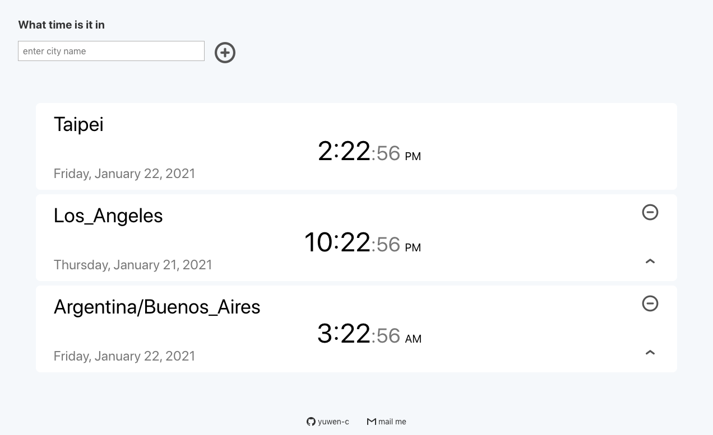
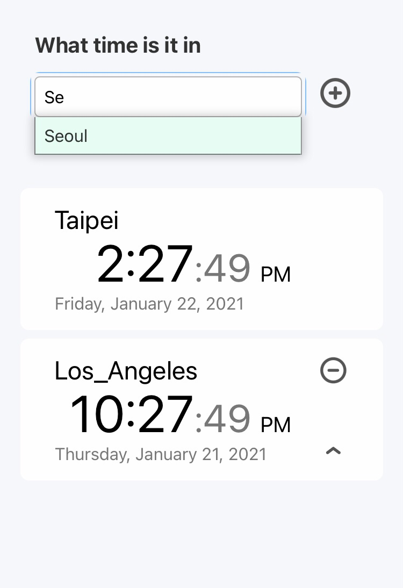
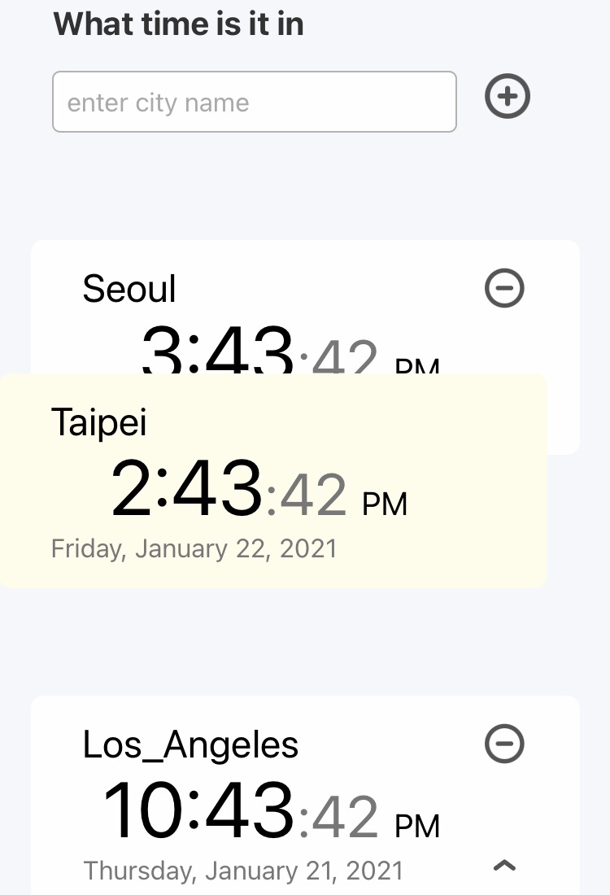

# Worldtime
## Fint out what time is it in any timezone. ⏱
## [see live](yuwen-worldtime-luxon.netlify.app/)

## evolution of this project 🦍  ⏩  👶
- I had a on-line spanish class, my teacher and I tried to find out a time which works for her (living in germany) and for me(living in Taiwan).
- Also, I wanted to practice connecting an API, so I made an [original one](https://yuwen-c.github.io/worldtime/)
- After that, I tried to show multiple timezones on the screen and turned out it had a serious delay on my app due to it's API.
- I needed an alternative, and indeed there were some: moment.js, luxon.js or even Javascript Date object.
- Out of curiosity, I studied about time and timezone and found out the meaning of existency of these libraries:
> get the present time of somewhere is easy, get "a certain past time" of somewhere is not!!
- 

  
   

## With this App you can...

- Open this App and it'll show your timezone and time.
- Find out a specific timezone by entering a city name.
- A drop down menu with corresponding cities will show when you're typing.

  
   

- Put multiply timezones on your screen at one time.
- Moving up or delete a timezone with clicking "up" button and "x" button.
- Dragging a timezone with mouse or by touching the mobile.

### [Try it](https://yuwen-worldtime-luxon.netlify.app/)  👈👈👈

## Features

✨ **Modern UI** for both mobile and desktop\
✨ Built by **React.js**\
✨ Styled with **Tachyons**\
✨ **Drag and drop** functionality with react-beautiful-dnd\
✨ get world time by **luxon**\
✨ Front-end deployed to **Netlify**

## How to use 🔍

- That's say you're looking for time of Seoul.
- Type s. e..., select Seoul, send.

  
   

- Seoul timezone is now on your screen.
- Try "up" and "delete" button in the right up side of each timezone.
- Try dragging up and down by mouse or touching on mobile.

  
   

