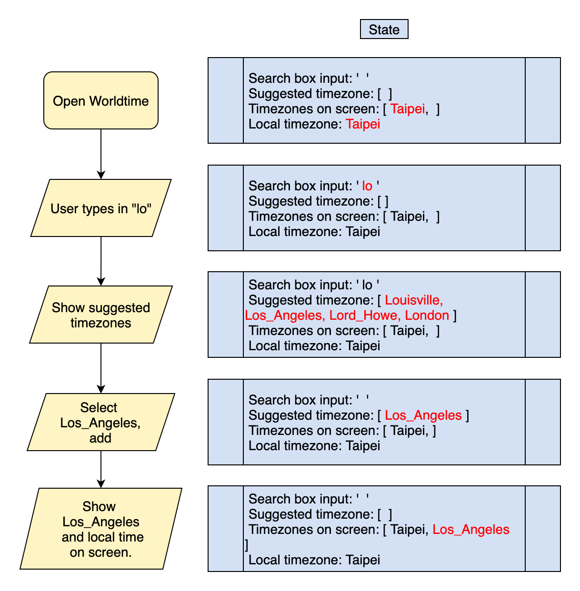
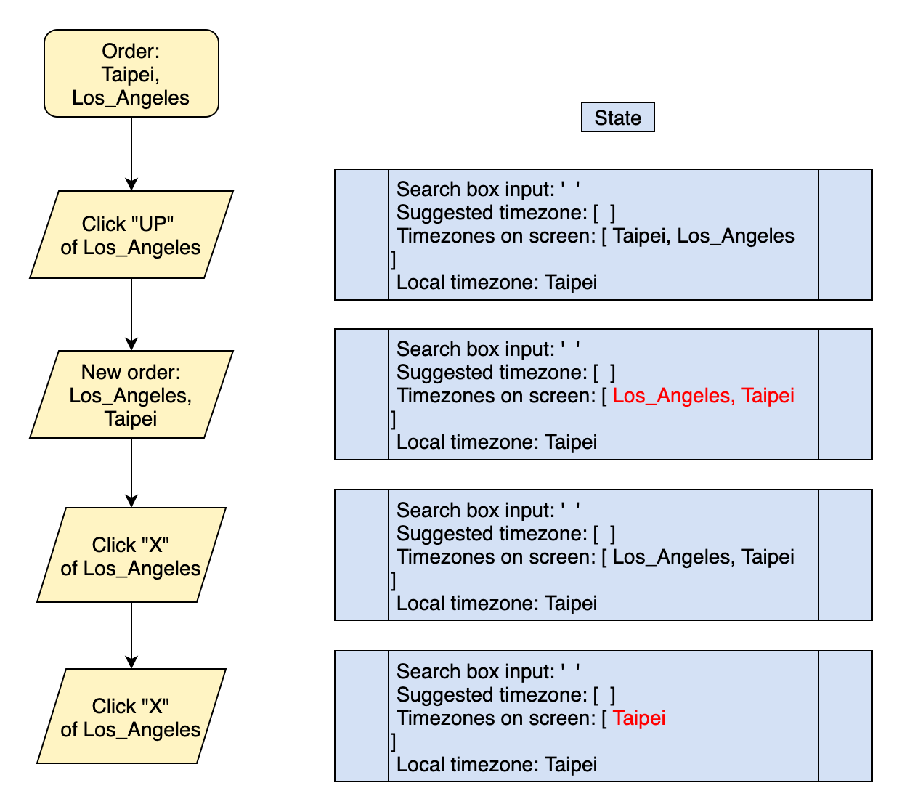
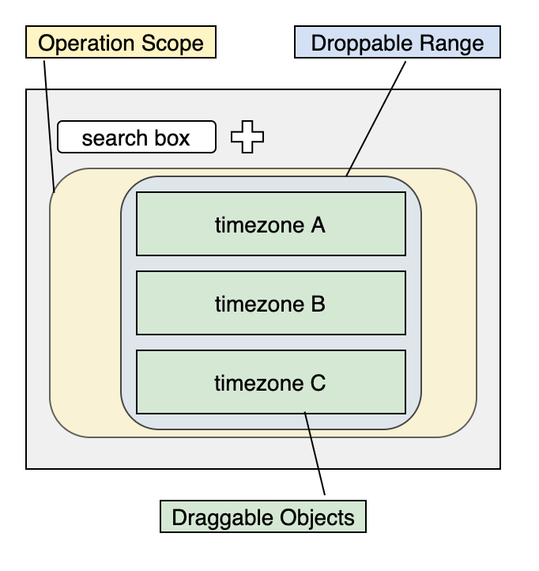

# Worldtime - Find out what time is it in any timezone. ⏱

### [中文版README](https://github.com/yuwen-c/worldtime-luxon/blob/master/README_Mandarin.md)
### [see live](https://yuwen-worldtime-luxon.netlify.app/)


## How to use 🔍
- Open this App and it'll show your timezone and time.
- That's say you're looking for time of Seoul.
- Type s. e..., select Seoul, send.

<div align="center">
  
  <br>
</div>

- Seoul timezone is now on your screen.
- Try "up" and "delete" button in the right up side of each timezone.
- Try dragging up and down by mouse or touching on mobile.

<div align="center">
  
  <br>
</div>


## evolution of this project 🧬
- I had a on-line spanish class, my teacher and I tried to find out a time which works for her (living in germany) and for me(living in Taiwan).
- Also, I wanted to practice connecting an API, so I made an [original one](https://yuwen-c.github.io/worldtime/)
- After that, I tried to show multiple timezones on the screen and turned out it had a serious delay on my app due to it's API.
- I needed an alternative, and indeed there were some: moment.js, luxon.js or even Javascript Date object.
- Out of curiosity, I studied about time and timezone and found out the meaning of existency of these libraries:
> get the present time somewhere is easy, get "a certain past time" somewhere is not!!
- Basically because it's so complicated and require a team with developers, historians to maintain the time database.
- Finally I choose Luxon.js to build my project, it works like a charm.
- To make this project more handy, I added the drag-and-drop function to it, and it became what it looks like now. 🙋


<div align="center">
  
  <br>
</div>


## Features
✨ Frond-end website using **React.js**.
－Similar to Javascript syntax.
－The whole app combines small components which are independent and reusable.
✨ Getting world time through [Luxon](https://moment.github.io/luxon/)\
－Better than ```moment.js``` and is still keep supported.
✨ **Drag and drop** function using ```react-beautiful-dnd```
－Works well for a grid system instead of dragging freely.
✨ Front-end website deploying to **Netlify**.
－Perfect for frond-end website, response immediately without waiting to be awakened.
－Synchronizing with github commits.
✨ Css style using Tachyons.
－Lightweight and easy to use.
✨ **Modern UI** for both mobile and desktop


## Details
### Get local time constantly
- When Worldtime is opened, local time will show on the screen and update constantly.

<div align="center">
  
  <br>
</div>

- Get local time with luxon in state.
- Update time every second in ```ComponentDidMount```.
- Remove timer with ```ComponentWillUnMount```.


### Find time in...
- Screen and state change when user is searching certain timezone:

<div align="center">
  
  <br>
</div>

- When user types in name of the timezone, the matching suggestions will show up.
- After submitting, the timezone and local time will appear together on the screen, and will be updated in real time.


### Click button to change order of timezones

<div align="center">
  
  <br>
</div>

- Click "UP" button then this timezone moves up 1 position.
- Use "X" button to remove the timezone.

### Luxon.js - time library:
- Get local time with luxon when app is opened.
- Get the selected timezone and transform to en_US format: March, 24, 2021.
- Extract information with ```slice``` string method and show on the screen.

### Drag and drop function:
- Define scopes and objects before using ```react-beautiful-dnd```:

<div align="center">
  
  <br>
</div>

1. The biggest operation scope, yellow square.
2. The range that objects can be dropped, blue square.
3. Objects that can be drag, green square.
- Operation scoppe in yellow: define how to generate new order. Set state of timezone order after dragging is over.
- Droppable range in blue: use default props, and set ref on the DOM.
- Draggable objects in green: assign id and index to every object, set ref to DOM. Use default props. Use snapshot to define special effects during dragging.

### button:
- Simple, intuitive button icon with svg.


