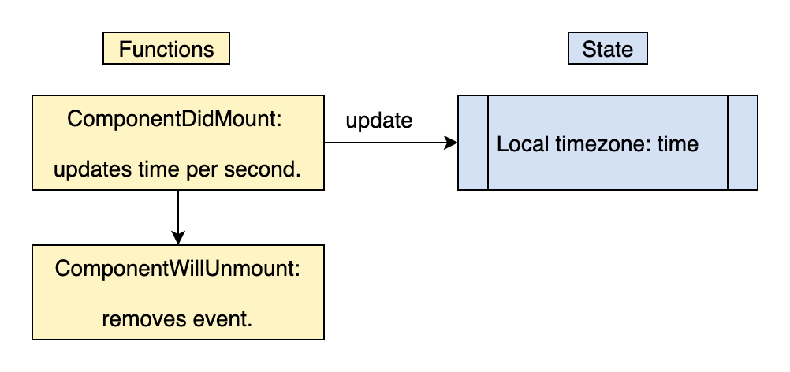
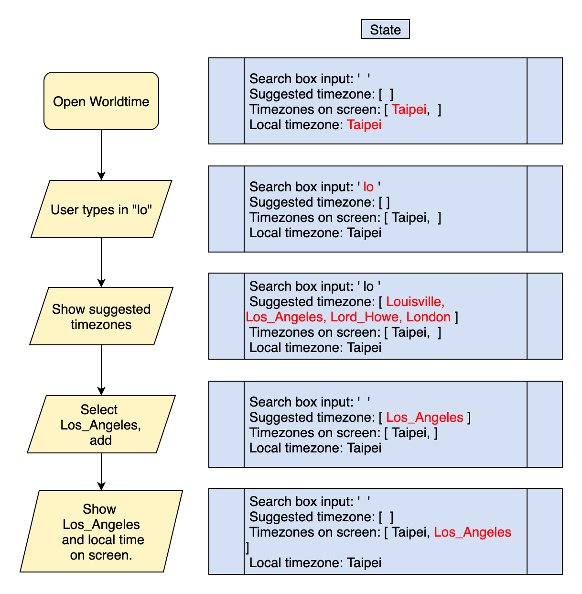
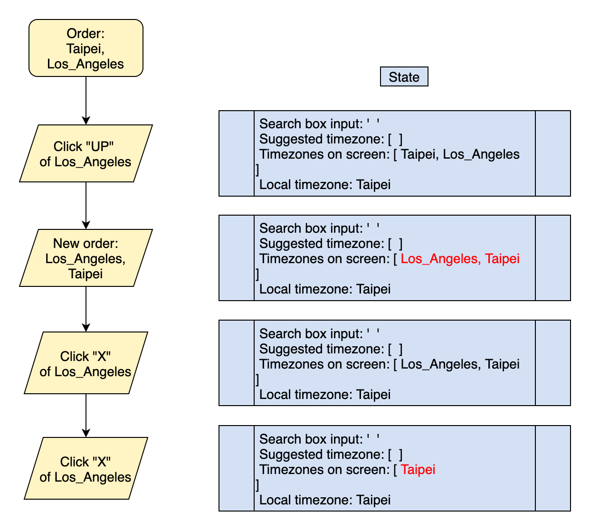
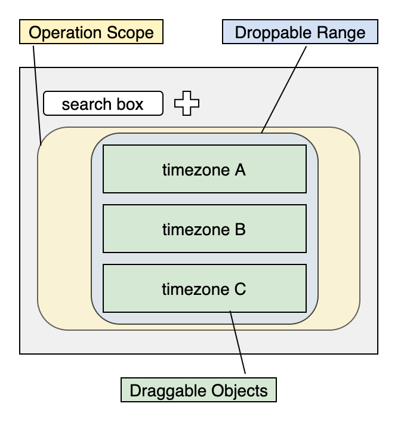

# Worldtime - 世界時區查詢網站 ⏱

### [readme in English](https://github.com/yuwen-c/worldtime-luxon/blob/master/README.md)
### [實際操作](https://yuwen-worldtime-luxon.netlify.app/)


<div align="center">
  
  <br>
</div>

## 如何使用 🔍
- 網頁一打開，畫面上會自動出現使用者所在時區及時間。
- 在搜尋格輸入時區的英文名稱，邊輸入時下方會出現符合的建議選項。

<div align="center">
  
  <br>
</div>

- 點選時區，按下加號按鈕，即可加入將時區加入畫面中。
- 可同時顯示多時區時間。
- 點選時區右下方的向上按鈕＾，改變順序。
- 也可用拖拉方式調整時區位置。

<div align="center">
  
  <br>
</div>

- 如要刪除，請按下時區右上方的減號按鈕。

## 作品動機及演進 🧬
- 為了跟人在德國的西班牙語老師約時間，要克服兩邊的時差，於是做了查詢時間的網站。
- 另一方面想練習接API，於是用了: [worldtime API](http://worldtimeapi.org/)
- 完成了[初步版本](https://yuwen-c.github.io/worldtime/)。
- 想要同時顯示多個時區，但原本用的API不堪負荷。
- 尋找替代方案：```Javascript Datetime object```, ```moment.js```, ```luxon.js```
  
**🎬 發現：為什麼解決「時間」是很複雜的問題？**
> 因為查詢某地的現在時間很容易，但要查詢過去的某一個特定時間很困難！
> 它牽涉到歷史事件、時區改變、日光節約時間等等。
> ——也因此需要一個龐大的資料庫來儲存，並且有賴工程師及歷史學家來維護。
- 最終我選擇使用```luxon.js```，毫無延遲，指令簡單(只是要把說明文件看懂😅)。
- 為了讓手機操作更直覺，我又加上drag and drop功能，可以用拖曳的方式調指時區順序。


## 特點
✨ 手機、桌機體驗良好的前端網站。\
✨ 使用**React.js**。——語法類似Javascript，利用多個元件架設，元件各自獨立且可重複使用\
✨ 利用[**Luxon**](https://moment.github.io/luxon/)抓各個時區的時間。——比```moment.js```更好，且持續在維護。\
✨ 利用react-beautiful-dnd完成**Drag and drop**拖曳功能。——適合這種不是將物件自由拖拉，而是有固定對齊格線的畫面呈現。\
✨ 網站部署到**Netlify**——適合靜態網站部署，且可與github連動更新\
✨ Css設計使用**Tachyons**——輕型、好用的css工具。


## 詳細作法

### 持續更新當地時間
- 當App開啟時，會自動抓取當地時間，並持續更新：

<div align="center">
  
  <br>
</div>

- 以luxon抓取當地時間，設為state。
- 以```ComponentDidMount```每秒持續更新該時間。
- 以```ComponentWillUnMount```清除計時器。

### 查詢時間
- 使用者查詢時間時，state及畫面的改變：

<div align="center">
  
  <br>
</div>

- 使用者輸入時區名稱，畫面會顯示符合的建議選項。
- 選取送出後，該時區時間，及當地時間，會一同出現在畫面上，並即時更新。


### 利用向上按鈕調整時區順序

<div align="center">
  
  <br>
</div>

- 要調整時區上下位置，點選「向上」的按鈕，會將該時區在時區列表中往前調一個位置。
- 如果點選刪除，可將此時區拿掉。

### Luxon.js - 時間函式庫:
- 利用luxon，在App開啟時，取得當地時間。
- 取得使用者所選擇的時區時間，並且轉換為英文的March, 24, 2021的日期格式。
- 用字串的slice方法取得需要的資訊，顯示在畫面上。

### Drag and drop 拖放功能:
- 要使用```react-beautiful-dnd```，要先界定3個範圍及物件：

<div align="center">
  
  <br>
</div>

1. 可操作的最大拖曳的範圍，黃色範圍。
2. 可「放下」物件的範圍，藍色部分。
3. 可拖拉的物件，綠色區塊。
- 黃色 拖曳範圍：要定義「產生新排序」的功能，且在拖曳結束時，更新時區順序的state。
- 藍色 可「放下」的範圍：使用預設的provided導入props，並且在DOM上面指定ref。
- 綠色 可拖拉的物件：每個物件都必須設定id及index，以及在DOM上設定ref，還有用provided導入props。另外也可以用snapshot設定拖拉時的特效。

### button:
- 利用svg圖檔做出符合直覺的圖示。

