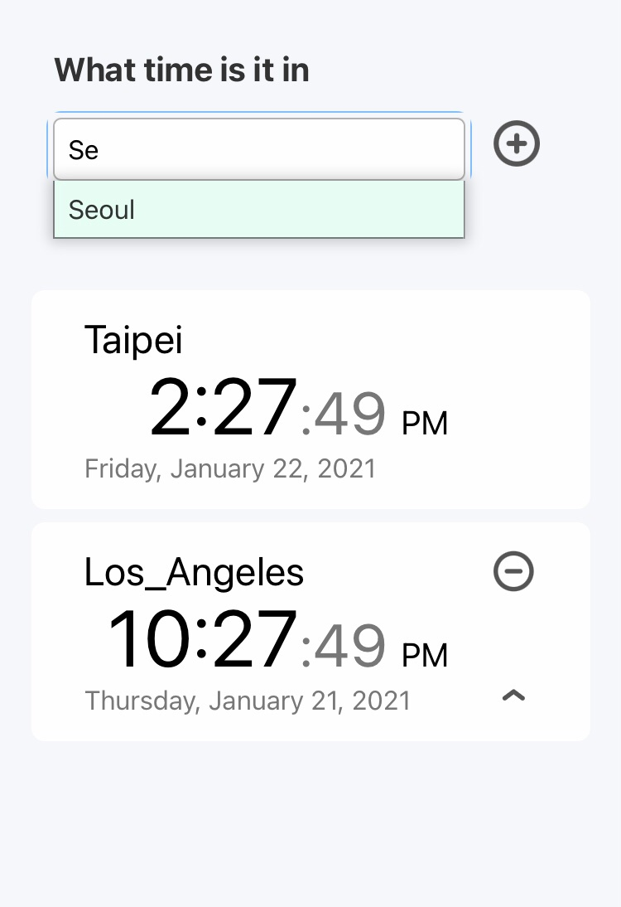
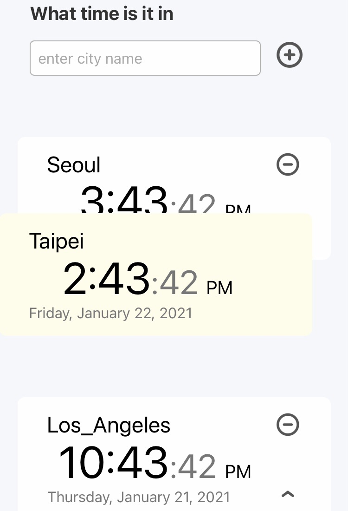

# Worldtime - 世界時區查詢網站 ⏱
## [來玩玩](yuwen-worldtime-luxon.netlify.app/)
## 英文版readme?? 要放嗎

<div align="center">
  
  <br>
</div>

## 如何使用
- 網頁一打開，畫面上會自動出現使用者所在時區及時間。
- 在搜尋格輸入時區的英文名稱，邊輸入時下方會出現符合的建議選項。

<div align="center">
  
  <br>
</div>

- 點選時區，按下加號按鈕，即可加入將時區加入畫面中。
- 可點選時區右下方的向上按鈕＾，改變順序。
- 也可用拖拉方式調整時區位置。
- 
<div align="center">
  
  <br>
</div>

- 如要刪除，請按下時區右上方的減號按鈕。

## 作品動機及演進
- 為了跟人在德國的西班牙語老師約時間，要克服兩邊的時差，於是做了查詢時間的網站。
- 另一方面想練習接API，於是用了: [worldtime API](http://worldtimeapi.org/)
- 完成了[初步版本](https://yuwen-c.github.io/worldtime/)。
- 想要同時顯示多個時區，但原本用的API不堪負荷。
- 尋找替代方案：```Javascript Datetime object```, ```moment.js```, ```luxon.js```
  
**🎬 發現：為什麼解決「時間」是很複雜的問題？**
> 因為查詢某地的現在時間很容易，但要查詢過去的某一個特定時間很困難！
> 它牽涉到歷史事件、時區改變、日光節約時間等等。
> ——也因此需要一個龐大的資料庫來儲存，並且有賴工程師及歷史學家來維護。
- 最終我選擇使用```luxon.js```，毫無延遲，指令簡單(只是要把說明文件看懂😅)。
- 為了讓手機操作更直覺，我又加上drag and drop功能，可以用拖曳的方式調指時區順序。


## 特點
✨ 手機、桌機體驗良好的前端網站。\
✨ 使用**React.js**。\
✨ 利用[**Luxon**](https://moment.github.io/luxon/)抓各個時區的時間。\
✨ 利用react-beautiful-dnd完成**Drag and drop**拖曳功能。\
✨ 網站部署到**Netlify**\
✨ Css設計使用**Tachyons**


## 詳細作法